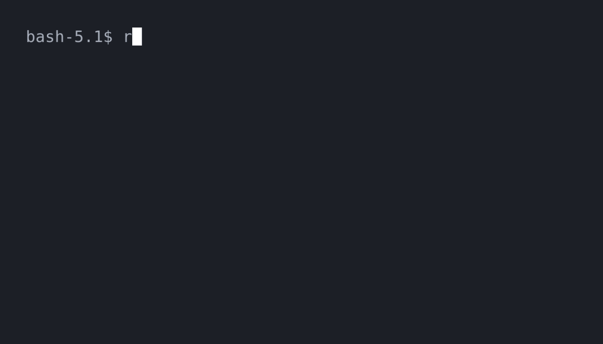

# retrieva

<p align="center">
  
</p>

A CLI tool for retrieving components from a remote repository. Similar to `npm install` but for components. There's no updating mechanism, so you can edit and modify installed components as you wish.

## Demo



## Prerequisites

- Node.js 18 or higher
- Git

## Installation

First, you need to install the package. You can do this globally or locally.

### NPM

```bash
npm i -g retrieva
```

### PNPM

```bash
pnpm i -g retrieva
```

### Yarn

```bash
yarn global add retrieva
```

## Usage

### Initialization

Any project using retrieva must have a `retrieva.json` present file in the root directory. The init command will create this file for you.

```bash
retrieva init
```

Interested in how the `retrieva.json` file looks like? Check out the one in this repository [here](./retrieva.json).

### Retrieval

To install one or more components, use the `get` command. Retrieva will then fetch the remote repository and install the components in the local project.

```bash
retrieva get <components...> # e.g. retrieva get button card
```
